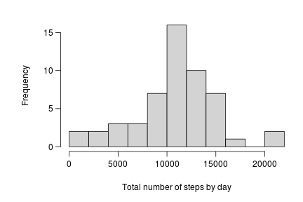
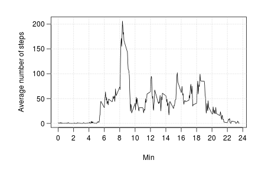
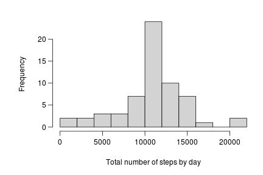
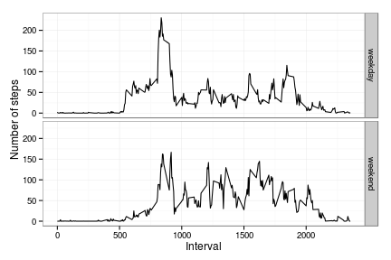

# Reproducible Research: Peer Assessment 1


## Loading and preprocessing the data
Load data about personal movement using activity monitoring devices.  
*date* variable is set to date format, and *interval* variable is
processed to a more comprensible form.


```r
Sys.setlocale("LC_TIME", "C")  # to avoid spanish locate
```

```
## [1] "C"
```

```r
mydata <- read.csv(unz("repdata-data-activity.zip", "activity.csv"))
mydata$date <- as.Date(mydata$date, "%Y-%m-%d")
mydata$hour <- floor(mydata$interval/100)
mydata$mins <- round(((mydata$interval/100) - mydata$hour) * 100)
# str(mydata) summary(mydata)
```


## What is mean total number of steps taken per day?
Following is an histogram of the total number of steps taken each day


```r
library(plyr)
total_steps <- ddply(mydata, .(date), summarise, nas = sum(is.na(steps)), N = length(interval), 
    steps = sum(steps))
par(mar = c(5, 6, 2, 1), mgp = c(3, 0.75, 0), las = 1)
hist(total_steps$steps, breaks = 8, main = "", xlab = "Total number of steps by day", 
    col = "lightgray")
```

 


And also the mean and median for the total number of steps taken each day

```r
list(mean = mean(total_steps$steps, na.rm = TRUE), median = median(total_steps$steps, 
    na.rm = TRUE))
```

```
## $mean
## [1] 10766
## 
## $median
## [1] 10765
```


## What is the average daily activity pattern?


```r
tseries <- ddply(mydata, .(interval), summarise, steps = mean(steps, na.rm = TRUE))
par(mar = c(5, 6, 2, 1), mgp = c(3, 0.75, 0), las = 1)
plot(tseries, type = "l", xaxt = "n", xlab = "Min", ylab = "Average number of steps")
axis(1, at = seq(0, 2400, 200), labels = c(0:24)[0:24%%2 == 0])
abline(v = c(0:24)[0:24%%2 == 0] * 100, h = seq(0, 200, 50), lty = "dotted", 
    col = "lightgray")
```

 


```r
max_steps <- tseries$interval[tseries$steps == max(tseries$steps)]
max_steps_hour <- floor(max_steps/100)
max_steps_mins <- ((max_steps/100) - max_steps_hour) * 100
```


The time of day that on average across all the days in the dataset contains the
maximum number of steps is 8:35 am.


## Imputing missing values
Total number of missing values in the dataset

```r
sum(is.na(mydata$steps))
```

```
## [1] 2304
```


Imputing missing data. Since missing is for complete days (8 days), imputation
is made considereing this days as having an avarage total steps distributed in
the 5-minute interval as the average. A new data set called **mydata2**
containing imput values is created.


```r
tseries$stepsP <- tseries$steps/sum(tseries$steps)
imput_miss_data <- function(x) {
    tot <- mean(total_steps$steps, na.rm = TRUE)
    steps_rate <- tseries$stepsP[tseries$interval == x]
    tot * steps_rate
}
impNA <- sapply(mydata$interval, imput_miss_data)
mydata$stepsWinput <- ifelse(is.na(mydata$steps), impNA, mydata$steps)
mydata2 <- mydata[, c("stepsWinput", "date", "interval", "hour", "mins")]
# summary(mydata2)
```


We are going to plot an histogram of the total number of steps taken
per day, and also he mean and median for this variable, but now including
imputated data


```r
total_steps2 <- ddply(mydata2, .(date), summarise, steps = sum(stepsWinput, 
    na.rm = TRUE))
par(mar = c(5, 6, 2, 1), mgp = c(3, 0.75, 0), las = 1)
hist(total_steps2$steps, breaks = 8, main = "", xlab = "Total number of steps by day", 
    col = "lightgray")
```

 

```r
list(mean = mean(total_steps2$steps, na.rm = TRUE), median = median(total_steps2$steps, 
    na.rm = TRUE))
```

```
## $mean
## [1] 10766
## 
## $median
## [1] 10766
```


Given that missing values correspond to full days and these values have been 
imputated with an average of the remaining days, the mean value does not vary.
Median also remains the same. Imputate missing values has no effect in this 
sample becuase NA's are observed in full days.


## Are there differences in activity patterns between weekdays and weekends?
Classify dates on weekday/weekends.

```r
mydata2$wday <- weekdays(mydata2$date, abb = TRUE)
mydata2$tday <- ifelse(mydata2$wday %in% c("Sat", "Sun"), "weekend", "weekday")
# summary(mydata2)
```


```r
tseries2 <- aggregate(stepsWinput ~ interval + tday, mydata2, mean, na.rm = TRUE)
par(mar = c(5, 6, 2, 1), mgp = c(3, 0.75, 0), las = 1)
library(ggplot2)
ggplot(tseries2, aes(x = interval, y = stepsWinput)) + facet_grid(tday ~ .) + 
    geom_line() + xlab("Interval") + ylab("Number of steps") + theme_bw()
```

 

